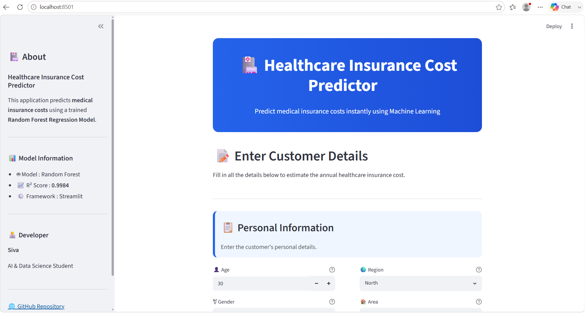
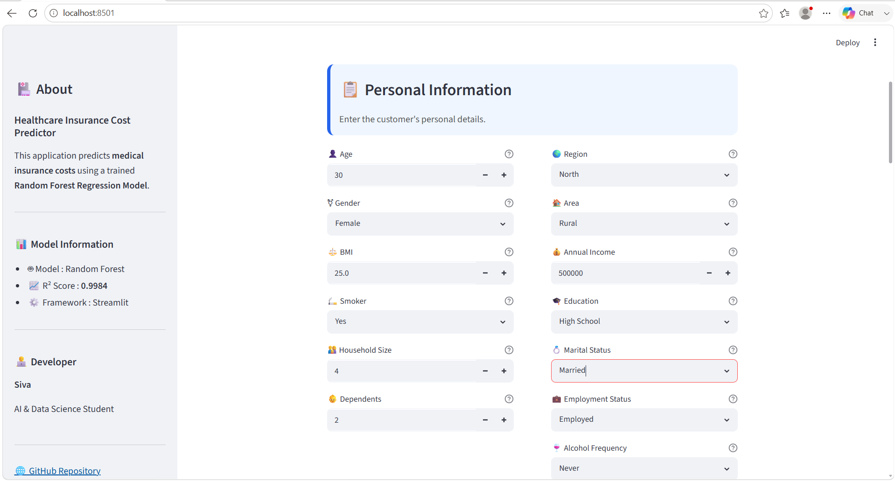
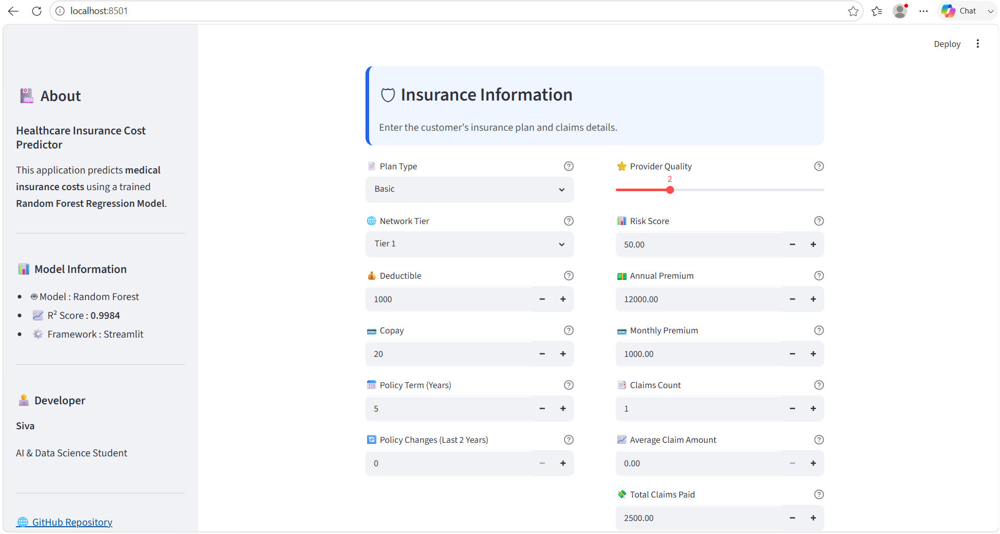
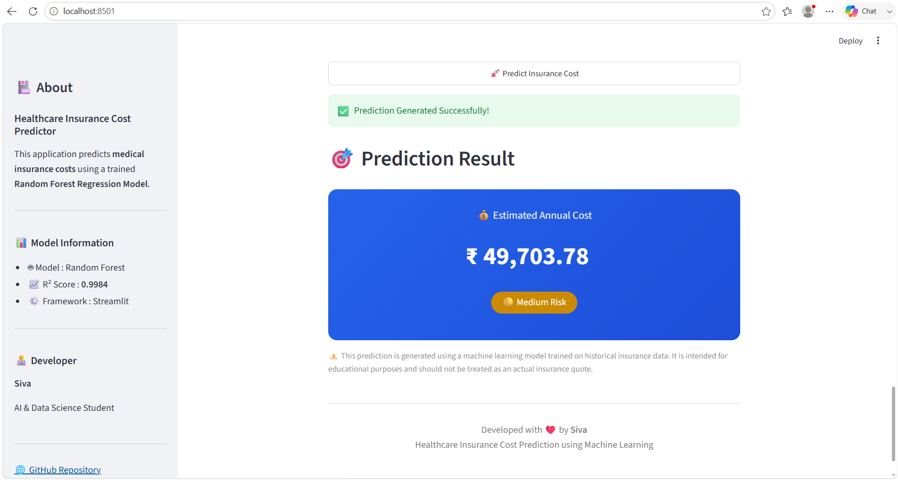

# 🏥 Healthcare Insurance Cost Prediction using Machine Learning


---

## 📖 Project Overview

Healthcare insurance providers need to estimate medical insurance costs based on an individual's demographic, lifestyle, and medical information. Manual estimation can be inconsistent and time-consuming.

This project develops a Machine Learning regression model capable of predicting healthcare insurance charges using patient information. It follows a complete end-to-end Machine Learning pipeline — from data preprocessing and exploratory data analysis to model training, evaluation, and deployment.

---

## ✨ Key Features

- 🤖 Predict healthcare insurance costs using a trained Random Forest model
- 📊 Complete end-to-end Machine Learning pipeline
- 🧹 Data cleaning, preprocessing, and feature engineering
- 📈 Exploratory Data Analysis (EDA) with visualizations
- ⚖️ Comparison of multiple regression models
- 🌐 Interactive Streamlit web application
- 💾 Model saved using Joblib for deployment

---

## 🖼️ Application Screenshots

### Home Page


### Input Form


### Insurance Information Section


### Prediction Result


---

## 🛠 Technologies Used

`Python` • `Pandas` • `NumPy` • `Scikit-learn` • `Matplotlib` • `Seaborn` • `Streamlit` • `Joblib` • `Git` • `GitHub`

| Category | Tools |
|-----------|------|
| **Programming** | Python |
| **Data Processing** | Pandas, NumPy |
| **Visualization** | Matplotlib, Seaborn |
| **Machine Learning** | Scikit-learn |
| **Model Saving** | Joblib |
| **Development** | Jupyter Notebook, VS Code |
| **Version Control** | Git, GitHub |
| **Deployment** | Streamlit |

---

## 📊 Dataset

**Source:** Kaggle

The dataset contains healthcare insurance records with demographic, medical, and lifestyle information.

| Feature | Description |
|---|---|
| Age | Age of the individual |
| Gender | Male / Female |
| BMI | Body Mass Index |
| Smoking Status | Smoker / Non-smoker |
| Exercise Frequency | Activity level |
| Alcohol Consumption | Consumption level |
| Chronic Diseases | Presence of chronic illness |
| Blood Pressure | Blood pressure reading |
| Diabetes | Diabetic status |
| Region | Geographic region |
| Income | Income level |
| **Insurance Charges** | 🎯 Target variable |

---

## 📂 Project Structure

```text
Healthcare-Insurance-Cost-Prediction/
│
├── app/
├── data/
├── images/
├── models/
├── notebooks/
├── reports/
├── README.md
├── requirements.txt
├── LICENSE
└── .gitignore
```

---

## 🚀 Machine Learning Workflow

```text
Raw Dataset (Kaggle)
        |
        v
Data Understanding
        |
        v
Data Cleaning
        |
        v
Exploratory Data Analysis
   • Distribution analysis
   • Outlier detection
   • Correlation analysis
   • Feature relationship analysis
        |
        v
Feature Engineering
   • BMI categories
   • Age groups
   • Lifestyle risk score
   • Medical risk indicators
        |
        v
Data Preprocessing
   • Encoding, scaling, train-test split
        |
        v
Model Training
   • Linear Regression      • Decision Tree
   • Random Forest          • Gradient Boosting
   • Extra Trees            • XGBoost (optional)
        |
        v
Model Evaluation
   • MAE · MSE · RMSE · R² Score
        |
        v
Hyperparameter Tuning
        |
        v
Final Model
        |
        v
Streamlit Deployment
   • User input form
   • Real-time prediction
   • Results visualization
```

---

## 📈 Model Performance

A detailed comparison of all trained models:

| Model | MAE | RMSE | R² Score |
|-------|-----|------|-----------|
| Linear Regression | 319.91 | 574.87 | 0.9664 |
| Decision Tree | 8.48 | 144.26 | 0.9979 |
| Random Forest | 7.67 | 126.63 | 0.9984 |
| Gradient Boosting | 54.31 | 127.18 | 0.9984 |
| Extra Trees | 6.33 | 150.40 | 0.9977 |

### 🏆 Best Model Performance

| Model | Random Forest Regressor |
|--------|-------------------------|
| R² Score | **0.9984** |
| MAE | **7.67** |
| RMSE | **126.63** |

### 💡 Prediction Example

**Input**
```text
Age: 35
Gender: Male
BMI: 28.5
Smoker: Yes
Exercise Frequency: Regular
Region: Southeast
```

**Output**
```text
Predicted Insurance Cost: ₹18,742.50
```
*(Sample output format — actual value depends on the trained Random Forest model and input data)*

---

## 🔗 Live Demo

🔗 [Add your deployed Streamlit link here once available]

---

## 🚀 Installation

Clone the repository

```bash
git clone https://github.com/<your-username>/Healthcare-Insurance-Cost-Prediction.git
```

Navigate into the project

```bash
cd Healthcare-Insurance-Cost-Prediction
```

Create a virtual environment

```bash
python -m venv .venv
```

Activate the environment

**Windows**
```bash
.venv\Scripts\activate
```

**Linux / macOS**
```bash
source .venv/bin/activate
```

Install dependencies

```bash
pip install -r requirements.txt
```

---

## ▶️ How to Run

Open Jupyter Notebook

```bash
jupyter notebook
```

or launch the Streamlit web application

```bash
python -m streamlit run app/app.py
```

---

## 📋 Future Improvements

- Add feature selection
- Hyperparameter optimization
- SHAP explainability
- Cross validation
- Docker deployment
- FastAPI integration
- Cloud deployment
- Real-time prediction API

---

## 🌟 Project Highlights

- End-to-end Machine Learning pipeline: data cleaning, EDA, feature engineering, model comparison, tuning, and deployment
- Random Forest achieved an R² Score of **0.9984**
- Interactive Streamlit web application for real-time predictions
- Professional, recruiter-friendly, ATS-friendly GitHub project structure
- Ready for deployment and portfolio showcase

---

## 💼 Interview Talking Point

> Developed an end-to-end Machine Learning solution to predict healthcare insurance costs using patient demographic, lifestyle, and medical information. The project includes data preprocessing, exploratory data analysis, feature engineering, model comparison, hyperparameter tuning, and deployment planning following industry-standard machine learning practices.

---

## 📊 Repository Summary

- Language: Python
- Machine Learning Task: Regression
- Deployment: Streamlit
- Best Model: Random Forest Regressor (R² Score: 0.9984)

---

## 👨‍💻 Author

**Siva**

AI & Data Science Student

Interested in:
- Data Analytics
- Machine Learning
- Python
- SQL
- Power BI

---

⭐ If you found this project helpful, please consider giving it a star.

Feel free to open an issue or submit a pull request for improvements.